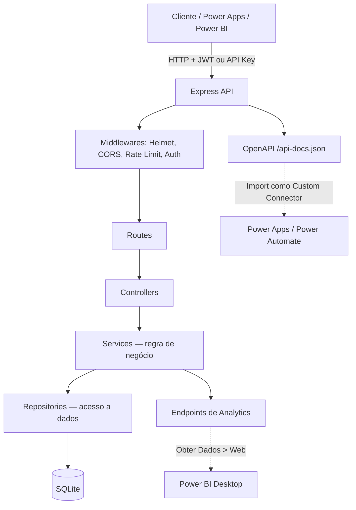

# 💰 FinTrack API

**REST API de controle financeiro pessoal** com autenticação JWT, orçamentos com alertas em tempo real, transações recorrentes e endpoints de analytics prontos para **Power BI** e **Power Apps / Power Automate**.

[](https://nodejs.org)
[](https://expressjs.com)
[](https://github.com/WiseLibs/better-sqlite3)
[](http://localhost:3000/api-docs)
[](LICENSE)

🇺🇸 [English](#-english) · 🇧🇷 [Português](#-português)

---

## 🇺🇸 English

### Why this project exists

Personal finance tracking is a problem everyone understands — which makes it easy to build shallow (yet another CRUD). This project goes further: real layered architecture, two purposeful auth methods (JWT for an interactive app, a long-lived API key for machine integrations), and — the differentiator — a genuine bridge to the BI/low-code tools data and business teams actually use day to day. It's not "you can technically call this API from Power BI"; the API was designed for that from the database schema up through the documentation.

### Features

- 🔐 **Dual authentication**: JWT (login-based) and long-lived API keys (integrations) — every route accepts either
- 💸 **Transactions**: full CRUD, filters by type/category/date range, pagination
- 🔁 **Recurring transactions**: rent, salary, subscriptions — auto-generated by a daily cron job (or on demand via endpoint)
- 📊 **Budgets**: monthly/yearly limit per category with real-time status (`ok` / `warning` / `exceeded`)
- 📈 **Power BI-ready analytics**: summary, spend-by-category, monthly trend, cash flow, CSV export
- 🔌 **Power Apps / Power Automate**: the OpenAPI spec (`/api-docs.json`) imports directly as a Custom Connector
- 🗂️ **Categories**: sensible defaults auto-seeded on registration, plus custom categories
- 🛡️ **Security**: Helmet, CORS, rate limiting (general + stricter on `/auth`), `express-validator` input validation, bcrypt password hashing
- 📚 **Interactive docs**: Swagger UI at `/api-docs`
- 🧪 **Automated tests**: `node:test` + Supertest against an in-memory SQLite database
- 🐳 **Docker**-ready
- 🌱 **Seed script**: generates a demo user with ~1 year of realistic transactions

### Tech stack

Node.js · Express · better-sqlite3 · JWT (`jsonwebtoken`) · `bcryptjs` · `express-validator` · `helmet` · `express-rate-limit` · `swagger-jsdoc` + `swagger-ui-express` · `node-cron` · `winston` · `node:test` + `supertest` · Docker

### Getting started

```bash
git clone <your-fork>
cd fintrack-api
npm install

# .env ships with working development defaults — edit as needed
npm run seed      # optional: creates demo@fintrack.com with a year of data
npm start         # http://localhost:3000
```

Interactive docs: `http://localhost:3000/api-docs`
OpenAPI spec (for Power Apps): `http://localhost:3000/api-docs.json`

**Docker:** `docker compose up --build`
**Tests:** `npm test`

### Power BI & Power Apps integration

- 📊 **[Full Power BI guide](docs/POWERBI_INTEGRATION.md)** — connecting via Get Data > Web, building cards and charts
- 🔌 **[Full Power Apps / Power Automate guide](docs/POWERAPPS_INTEGRATION.md)** — importing the OpenAPI spec as a Custom Connector, a quick-expense-entry app example, and a Microsoft Forms → API flow

### Reliability & scale

Points that went through a dedicated pass for concurrency and production behavior — not just the happy path:

- **Concurrency errors don't leak as 500s**: a SQLite unique-constraint violation (two writes racing on the same budget, for instance) is translated to a clean 409 by the error middleware instead of exposing raw SQL to the client — [`error.middleware.js`](src/middlewares/error.middleware.js), tested against the real driver.
- **`busy_timeout` is set** (5s) — without it, a second concurrent writer (e.g. the recurring-transactions job running alongside a live request) fails immediately instead of waiting for the lock to clear.
- **Batch writes use `db.transaction()`**: both the seed script and recurring-transaction processing group multiple `INSERT`s into one transaction — avoids an fsync per row and guarantees atomicity (no risk of a duplicate entry if the process dies mid-loop).
- **Budget query bounded by date**: the transactions JOIN is capped at the start of the current year, so it doesn't rescan years of category history on every request.
- **`trust proxy` is configurable** via `TRUST_PROXY` — without it, every visitor behind a reverse proxy/PaaS (Render, Railway, nginx...) would share one IP for rate-limiting purposes.
- **`/health` checks the database for real** (not just "the process is alive"), and the logger never crashes the process if the log filesystem turns read-only (common on serverless).
- **Consistency rules apply on UPDATE, not just CREATE**: editing a transaction validates category/type across all three cases (category changed, type changed, or both); recurrence is immutable after creation (avoids a transaction flagged recurring that never actually recurs, from not recomputing `next_occurrence_date`); deleting a category is blocked if a budget is attached, not just transactions.

### Known limitations / next steps

- Month-end recurring dates (e.g. the 31st) roll into the next month rather than clamping to the last day — documented and covered by a test.
- No refresh tokens (deliberate scope decision).
- Single-currency only.
- Repository layer already isolates the database, making a future Postgres migration straightforward.

### License

MIT — see [LICENSE](LICENSE).

---

## 🇧🇷 Português

### Por que este projeto existe

Controle financeiro é um problema que todo mundo entende — e por isso mesmo é fácil fazer de forma rasa (um CRUD qualquer). Este projeto foi pensado para ir além: arquitetura em camadas real, autenticação com dois métodos pensados para públicos diferentes (JWT para uma aplicação interativa, API key de longa duração para integrações de máquina) e, principalmente, uma ponte **de verdade** com ferramentas de BI/low-code que times de dados e de negócio usam no dia a dia — não é só "consumir uma API", é a API ter sido desenhada para isso desde o schema do banco até a documentação.

### Funcionalidades

- 🔐 **Autenticação dupla**: JWT (login) e API key de longa duração (integrações) — qualquer rota aceita as duas
- 💸 **Transações**: CRUD completo, filtros por tipo/categoria/período, paginação
- 🔁 **Transações recorrentes**: aluguel, salário, assinaturas — geradas automaticamente por um cron job diário (ou sob demanda via endpoint)
- 📊 **Orçamentos**: limite mensal/anual por categoria, com status calculado em tempo real (`ok` / `warning` / `exceeded`)
- 📈 **Analytics prontos para Power BI**: resumo, gasto por categoria, tendência mensal, fluxo de caixa, exportação CSV
- 🔌 **Power Apps / Power Automate**: a especificação OpenAPI (`/api-docs.json`) importa direto como Custom Connector
- 🗂️ **Categorias**: padrão (pt-BR) seedadas automaticamente no registro + categorias customizadas
- 🛡️ **Segurança**: Helmet, CORS, rate limiting (geral + reforçado em `/auth`), validação de entrada com `express-validator`, senhas com bcrypt
- 📚 **Documentação interativa**: Swagger UI em `/api-docs`
- 🧪 **Testes automatizados**: `node:test` + Supertest, banco SQLite em memória
- 🐳 **Docker** pronto para produção
- 🌱 **Seed script**: gera 1 usuário demo com ~1 ano de transações realistas

### Arquitetura



Camadas **Controller → Service → Repository** isolam HTTP, regra de negócio e acesso a dados — cada uma pode ser testada e trocada independentemente (por exemplo, trocar SQLite por Postgres exigiria mudar só a camada de repository).

### Stack técnica

Node.js · Express · better-sqlite3 · JWT (`jsonwebtoken`) · `bcryptjs` · `express-validator` · `helmet` · `express-rate-limit` · `swagger-jsdoc` + `swagger-ui-express` · `node-cron` · `winston` · `node:test` + `supertest` · Docker

### Como rodar

```bash
git clone <seu-fork>
cd fintrack-api
npm install

# o .env já vem preenchido com valores de desenvolvimento — ajuste se quiser
npm run seed      # opcional: cria o usuário demo@fintrack.com com dados de 1 ano
npm start         # http://localhost:3000
```

Documentação interativa: `http://localhost:3000/api-docs`
Especificação OpenAPI (para Power Apps): `http://localhost:3000/api-docs.json`
Health check: `http://localhost:3000/health`

**Docker:**

```bash
docker compose up --build
```

**Testes:**

```bash
npm test
```

### Principais endpoints

| Método | Rota | Descrição |
|---|---|---|
| POST | `/api/auth/register` | Cria conta (já vem com categorias padrão + API key) |
| POST | `/api/auth/login` | Login → JWT |
| GET | `/api/auth/me` | Perfil do usuário autenticado |
| POST | `/api/auth/api-key/regenerate` | Gera uma nova API key |
| GET/POST | `/api/categories` | Listar / criar categorias |
| GET/POST | `/api/transactions` | Listar (com filtros + paginação) / criar transações |
| POST | `/api/transactions/process-recurring` | Processa recorrências manualmente |
| GET/POST | `/api/budgets` | Listar (com status) / criar orçamentos |
| GET | `/api/analytics/summary` | Receita, despesa e saldo do período |
| GET | `/api/analytics/by-category` | Total por categoria |
| GET | `/api/analytics/monthly-trend` | Receita vs. despesa por mês |
| GET | `/api/analytics/cash-flow` | Fluxo de caixa diário |
| GET | `/api/analytics/export/csv` | Exportação CSV das transações |

Lista completa, com schemas de request/response, no Swagger UI.

### Integração com Power BI e Power Apps

- 📊 **[Guia completo Power BI](docs/POWERBI_INTEGRATION.md)** — conectar via "Obter Dados > Web", montar cartões, gráficos de categoria/tendência/fluxo de caixa
- 🔌 **[Guia completo Power Apps / Power Automate](docs/POWERAPPS_INTEGRATION.md)** — importar `/api-docs.json` como Custom Connector, exemplo de app para lançar despesas e de fluxo Microsoft Forms → API

Coleção pronta para o Postman em [`postman/FinTrack.postman_collection.json`](postman/FinTrack.postman_collection.json).

### Confiabilidade e escala

Pontos que passaram por uma revisão dedicada a concorrência e produção — não só "funciona no feliz caminho":

- **Erros de concorrência não vazam como 500**: uma violação de constraint única do SQLite (ex.: duas escritas batendo no mesmo orçamento) é traduzida para um 409 limpo pelo middleware de erro, em vez de expor SQL cru ao cliente — [`error.middleware.js`](src/middlewares/error.middleware.js), com teste contra o driver real.
- **`busy_timeout` configurado** (5s) — sem isso, uma segunda escrita concorrente (ex.: o job de recorrência rodando junto com uma requisição) falha na hora em vez de esperar a primeira liberar o lock.
- **Escritas em lote usam `db.transaction()`**: tanto o seed script quanto o processamento de recorrências agrupam múltiplos `INSERT`s numa única transação — evita um `fsync` por linha e garante atomicidade (sem risco de duplicar lançamento se o processo cair no meio).
- **Consulta de orçamentos limitada por data**: o JOIN com transações é limitado ao início do ano corrente, para não escanear anos de histórico numa categoria a cada consulta.
- **`trust proxy` configurável** via `TRUST_PROXY` — sem isso, atrás de um proxy reverso/PaaS (Render, Railway, nginx...) todo mundo cairia no mesmo IP para o rate limiter.
- **`/health` verifica o banco de verdade** (não só "o processo está de pé"), e o logger nunca derruba o processo se o filesystem de logs virar somente-leitura (comum em ambientes serverless).
- **Regras de consistência em UPDATE, não só em CREATE**: editar uma transação valida categoria/tipo nos três casos possíveis (mudou categoria, mudou tipo, ou ambos); recorrência é imutável após a criação (evita uma transação marcada como recorrente que nunca dispara, por não recalcular `next_occurrence_date`); deletar categoria bloqueia se houver orçamento associado, não só transações.

### Limitações conhecidas / próximos passos

Nenhum projeto é perfeito — documentar o que falta é parte de projetá-lo bem:

- **Recorrência mensal em datas de virada de mês** (ex.: dia 31) usa aritmética padrão de `Date` do JS, que rola para o mês seguinte em vez de "grudar" no último dia (ex.: 31/jan mensal vira 03/mar, não 28/fev). Coberto por teste (`tests/unit/recurring.service.test.js`) documentando o comportamento atual.
- Sem **refresh tokens** — o JWT expira e exige novo login (simplificação intencional para manter o escopo enxuto).
- Sem **multi-moeda** — todos os valores assumem uma moeda única (BRL, implicitamente).
- Migração seria o próximo passo natural para Postgres em um cenário multi-usuário de produção (a camada de repository já isola essa troca).

### Estrutura do projeto

```
fintrack-api/
├── src/
│   ├── config/        # Swagger/OpenAPI
│   ├── controllers/    # HTTP handlers (finos)
│   ├── services/       # Regra de negócio
│   ├── repositories/   # Acesso a dados (SQL)
│   ├── middlewares/     # Auth, erros, rate limit, validação
│   ├── routes/          # Definição de rotas + docs Swagger
│   ├── jobs/            # Cron job de recorrências
│   └── database/        # Conexão, migrations, seeds
├── tests/               # node:test + supertest
├── scripts/seed.js       # Popula dados de demonstração
├── postman/              # Coleção Postman
├── docs/                 # Guias Power BI / Power Apps
└── docker-compose.yml
```

